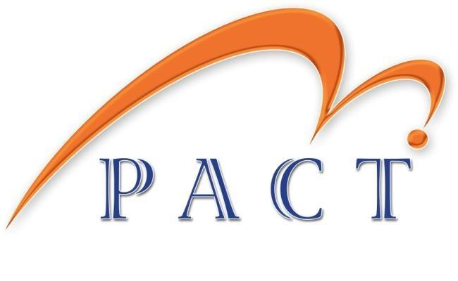

# PACT Mobile App



Welcome to the PACT Mobile App! This application is designed to provide a seamless, offline-first experience for PACT Consultancy field consultants. Built using Flutter, the app features robust authentication, comprehensive task management, equipment tracking, safety reporting, and automatic data synchronization.

## 🚀 Key Features

### 🔐 Authentication System
- **Secure Login**: Email/password authentication with Supabase
- **User Registration**: New user signup with validation
- **Password Recovery**: Email-based password reset functionality
- **Profile Management**: User profile storage and synchronization

### 📱 Offline-First Architecture
- **Local Data Storage**: All data persists locally using Hive NoSQL database
- **Automatic Sync**: Background synchronization every 5 minutes when online
- **Manual Sync**: User-triggered sync via app menu with progress notifications
- **Conflict Resolution**: Intelligent merging of local and remote data
- **Connectivity Monitoring**: Real-time online/offline status detection

### 📋 Task Management (Field Visits)
- **Visit Assignments**: View and manage assigned field tasks/visits
- **Status Tracking**: Update task status (pending, in-progress, completed)
- **GPS Integration**: Location tracking and arrival detection
- **Journey Logging**: Path recording during field operations
- **Offline Access**: Full task management without internet connectivity

### 🛠️ Equipment Management
- **Inventory Tracking**: Comprehensive equipment database
- **Maintenance Scheduling**: Inspection date tracking and alerts
- **Status Updates**: Real-time equipment status and location updates
- **Search & Filter**: Advanced filtering and search capabilities

### 🛡️ Safety & Incident Reporting
- **Incident Reports**: Create detailed safety incident reports
- **Safety Checklists**: Pre-defined compliance checklists
- **Media Attachments**: Photo uploads for incident documentation
- **Severity Classification**: Incident categorization and prioritization
- **Location Tagging**: GPS coordinates for all safety reports

### 🗺️ Mapping & Location Services
- **Real-time GPS**: Continuous location tracking
- **Visit Mapping**: Interactive maps for task locations
- **Arrival Detection**: Automatic check-in at visit sites
- **Route Recording**: Journey path visualization

### 📊 Reporting & Analytics
- **Visit Reports**: Comprehensive post-visit reporting
- **Photo Documentation**: Image attachments to reports
- **Audit Trail**: Complete activity history and timestamps
- **Data Export**: Report generation and sharing capabilities

## 🏗️ Technical Architecture

### Technology Stack
- **Framework**: Flutter (Dart)
- **State Management**: Provider pattern with custom providers
- **Local Storage**: Hive NoSQL database for offline persistence
- **Backend**: Supabase (PostgreSQL) with real-time subscriptions
- **Authentication**: Supabase Auth
- **UI Framework**: Material Design with flutter_animate
- **Mapping**: Integrated GPS and location services

### Project Structure
```
lib/
├── main.dart                    # App entry point, theme, and routing
├── authentication/              # Login, registration, password reset
├── screens/                     # Main app screens (tasks, equipment, etc.)
├── widgets/                     # Reusable UI components
├── services/                    # Business logic (sync, storage, connectivity)
│   ├── local_storage_service.dart
│   ├── offline_sync_service.dart
│   ├── connectivity_service.dart
│   └── auth_service.dart
├── providers/                   # State management
│   ├── sync_provider.dart
│   └── auth_provider.dart
├── models/                      # Data models
│   ├── task.dart
│   ├── equipment.dart
│   ├── safety_report.dart
│   └── user_profile.dart
├── theme/                       # Colors, gradients, styling
├── utils/                       # Helper functions
└── l10n/                        # Localization files
```

### Database Schema

The app uses Supabase with the following core tables:

- **users**: User profiles and authentication data
- **visits**: Task/visit assignments and tracking
- **equipment**: Equipment inventory and maintenance
- **incident_reports**: Safety incidents and reports
- **safety_checklists**: Safety compliance checklists
- **reports**: Visit completion reports
- **report_photos**: Photo attachments
- **location_logs**: GPS tracking data

## 📋 Prerequisites

- Flutter SDK (3.0.0 or higher)
- Dart SDK (2.19.0 or higher)
- Android Studio or Xcode for development
- Supabase account for backend services

## 🛠️ Installation & Setup

### 1. Clone the Repository
```bash
git clone https://github.com/PACT-CONSULTANCY/PACT_mobile.git
cd PACT_mobile
```

### 2. Install Dependencies
```bash
flutter pub get
```

### 3. Supabase Configuration
1. Create a new Supabase project at [supabase.com](https://supabase.com)
2. Run the database schema from `database/schema.sql` in your Supabase SQL editor
3. Copy your project URL and anon key
4. Create a `.env` file or update `lib/main.dart` with your credentials:

```dart
await Supabase.initialize(
  url: 'YOUR_SUPABASE_PROJECT_URL',
  anonKey: 'YOUR_SUPABASE_ANON_KEY',
);
```

### 4. Run the App
```bash
flutter run
```

## 🧪 Testing

### Unit Tests
```bash
flutter test
```

### Integration Tests
```bash
flutter test integration_test/
```

### Offline Testing
- Use device settings to simulate offline mode
- Test sync functionality when reconnecting
- Verify data persistence across app restarts

## 📱 Build & Deployment

### Android APK
```bash
flutter build apk --release
```

### iOS Build
```bash
flutter build ios --release
```

### App Store Deployment
1. Configure app store credentials
2. Update version numbers in `pubspec.yaml`
3. Build and submit through respective app stores

## 🔧 Development Guidelines

### Code Style
- Follow Dart/Flutter best practices
- Use meaningful variable and function names
- Add comprehensive documentation comments

### State Management
- Use Provider for app-wide state
- Implement proper error handling
- Follow reactive programming patterns

### Offline-First Development
- Always test features in offline mode
- Implement proper sync conflict resolution
- Use local storage for all user data

### UI/UX Standards
- Maintain consistent design language
- Use the centralized color scheme
- Implement smooth animations and transitions

## 🤝 Contributing

1. Fork the repository
2. Create a feature branch (`git checkout -b feature/amazing-feature`)
3. Commit your changes (`git commit -m 'Add amazing feature'`)
4. Push to the branch (`git push origin feature/amazing-feature`)
5. Open a Pull Request

## 📄 License

This project is licensed under the MIT License. See the LICENSE file for details.

## 🆘 Support

For support and questions:
- Create an issue in this repository
- Contact the development team
- Check the documentation for common solutions

## 📈 Future Roadmap

- **Advanced Analytics**: Performance dashboards and metrics
- **Push Notifications**: Real-time alerts for task assignments
- **Offline Maps**: Full offline map tile caching
- **Team Collaboration**: Multi-user task management
- **Enhanced Security**: Biometric authentication
- **Multi-language Support**: Internationalization
- **Dark Mode**: Theme switching capability

---

**PACT Consultancy** - Empowering Field Operations Through Technology


